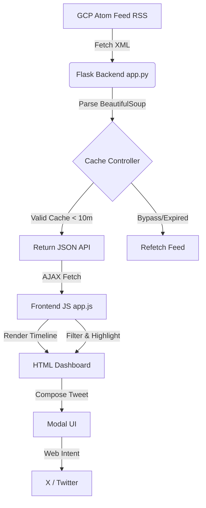
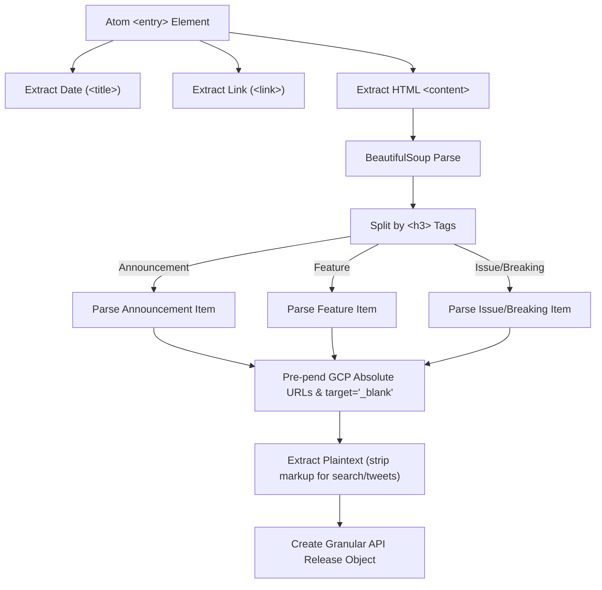

# BigQuery Release Hub (zahard-event-talks-app)

A premium, highly interactive dashboard built to browse Google BigQuery release notes, filter updates by categories, perform instant keyword searches with visual highlights, and easily compose and share customized updates directly on **X (Twitter)**.

---

## Architecture & Data Pipelines

The application is structured as a lightweight, performant, and self-contained Python Flask service. The following flowcharts describe the layout, logic, and parsing pipelines.

### High-Level Architecture Flow


### Entry Parsing & Formatting Pipeline
Google Cloud publishes release notes in daily batches under a single Atom entry. The Flask service extracts and splits these entries into discrete updates:


---

## Features

1. **Category Counter & Filtering**: A responsive navigation deck displaying counts dynamically filtered by status (Features, Announcements, Issues, Breaking Changes, and General Changes).
2. **Interactive Search Highlighting**: Pressing the `/` shortcut focuses the search box. Typing executes an instant search, dynamically highlighting matches in the release notes text while skipping tag syntax.
3. **Advanced X (Twitter) Composer Modal**:
   - **Multi-Style Templates**: Switch between **Standard**, **Excited (Hype)**, and **Minimal** formats at the click of a button.
   - **X-Compliant Length Math**: Emulates Twitter's link formatting, capping all links to a static 23-character calculation to provide accurate remaining-character thresholds.
   - **Visual Character Progress Meter**: An SVG circular progress ring that dynamically fills and changes colors (Cyan/Blue -> Amber Warning -> Red Danger) as you approach the 280-character limit.
   - **Copy-to-Clipboard & Toast Alerts**: Direct integration using the Clipboard API with transient status changes and responsive notifications.
4. **Shimmer Skeletal Loading**: Replaces generic spinners with animated gradients indicating structure while fetching updates.

---

## Running Locally

### Prerequisites
* Python 3.10 or higher installed.

### Setup Steps
1. Clone the repository:
   ```bash
   git clone https://github.com/uShaukat3737/zahard-event-talks-app.git
   cd zahard-event-talks-app
   ```

2. Install the requirements:
   ```bash
   pip install -r requirements.txt
   ```

3. Start the Flask application:
   ```bash
   python3 app.py
   ```

4. Open your browser and navigate to:
   [http://127.0.0.1:5001](http://127.0.0.1:5001)

---

## File Directory
* `app.py`: Flask service and XML-to-JSON Atom feed parser.
* `requirements.txt`: Project package dependencies.
* `templates/index.html`: Responsive HTML5 dashboard layout.
* `static/css/style.css`: Clean, variables-based visual styles.
* `static/js/app.js`: Core interactive frontend logic (search highlighting, templates, tweet intent).
